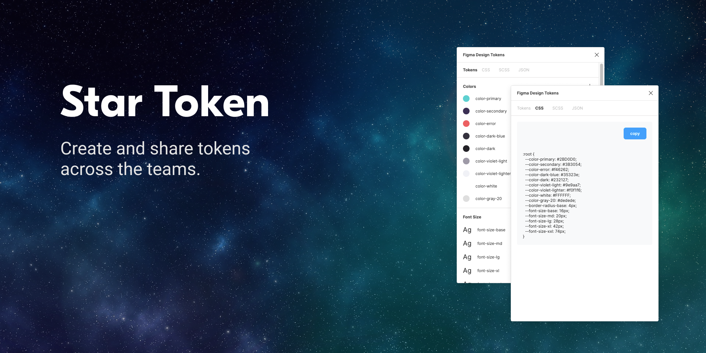

# Star Token

[](https://github.com/vinicius-pretto/star-token/blob/master/LICENSE.md)

The goal of this project is to give ability to create and share tokens on Figma.



## Running on development environment

**Requirements:**

- OS System (macOS or Windows)
- Node.js >= v10.22
- NPM >= v6.14.6

**1. Install dependencies**

```
$ npm install
```

**2. Build application**

```
$ npm run build
```

## License

[MIT](https://github.com/vinicius-pretto/star-token/blob/master/LICENSE.md)
